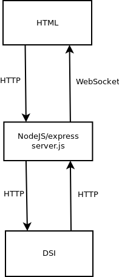

# Communication between a Web Application and DSI using NodeJS

This sample is showing how a Web application can send events to DSI
and receive events from DSI by using the REST API and NodeJS.

## Prerequisites

Build the docker image of DSI, see the [README.md](../../../README.md).

## Run NodeJS and DSI

In order to run both the NodeJS application and DSI with Docker compose:

```
./run.sh
```

Then open the URL: `http://localhost:8080`. It will present a very
simple Web application for sending events to DSI and displaying the events
received from DSI.

## How it works



### Send events from NodeJS to DSI

The form in the [HTML page](pub/index.html) sends an HTTP POST to the
NodeJS application. In [server.js](./server.js), the method `sendEvent`
sends the event to DSI using its HTTP inbound connectivity feature.

### Receive events in NodeJS from DSI

DSI emits events through the HTTP oubound connectivity to the NodeJS
application using its HTTP endpoint `/out`.
The NodeJS application in [server.js](./server.js) sends the event to
the HTML page by using the
[WebSocket API](https://www.w3.org/TR/websockets/):

```
app.post("/out", function (req, res) {
    io.sockets.emit('event', JSON.stringify(req.body));
    res.status(200).end();
});
```
